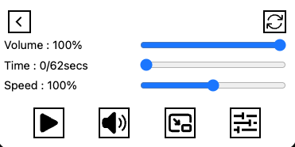

# Video Controller for Chromium

## How to Install
1. Move to any directory you like.
2. Run this command: `git clone https://github.com/NicoN5/video-controller-for-chromium.git`
3. Run this command to build the project locally: `npm run build`
4. Open your browser.
5. Open the extension settings.
6. Enable "Developer Mode".
7. Click the 'Load unpacked' button.
8. Select the "dist" directory generated by the previous steps.

## How to Use

1. Click the extension icon.
2. Videos on the current page are shown in the extension popup.
3. In the popup, click any video thumbnail you like.
4. Each button has a different function. For example, the "Time" slider controls playback time.
